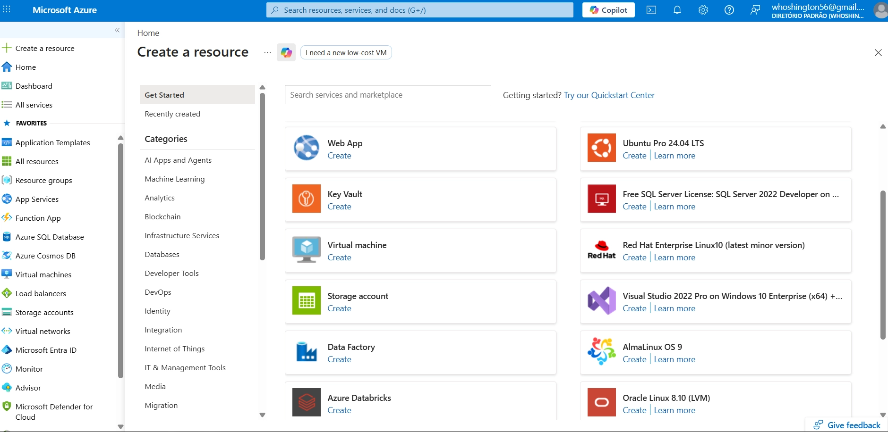
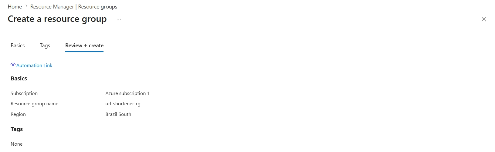
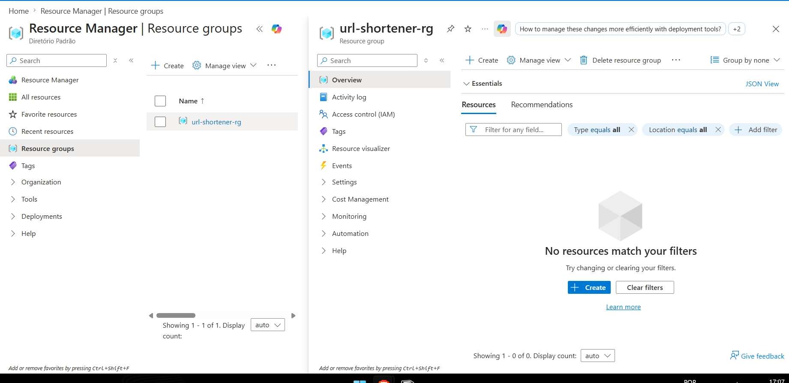
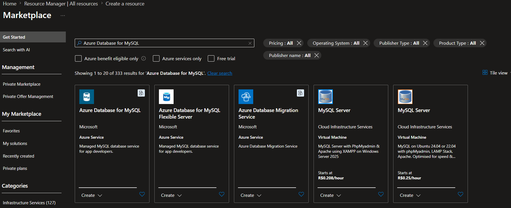
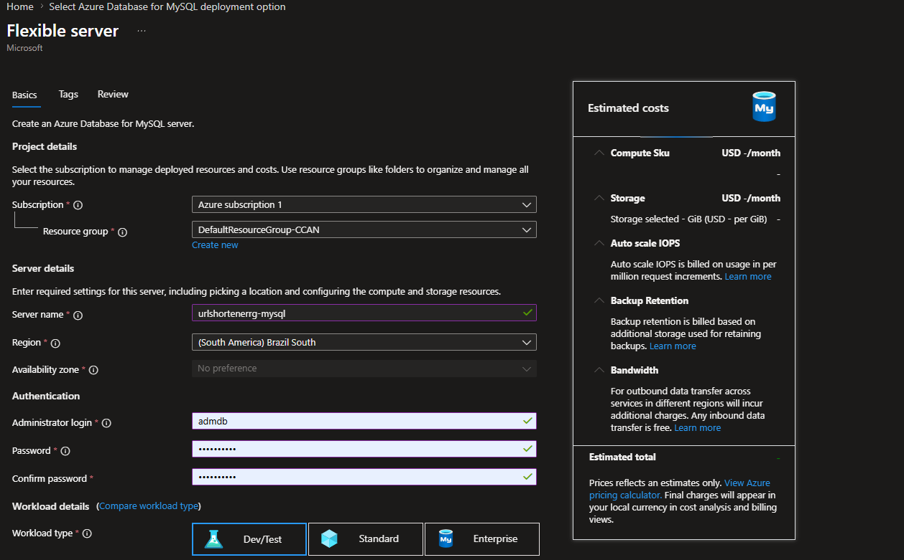
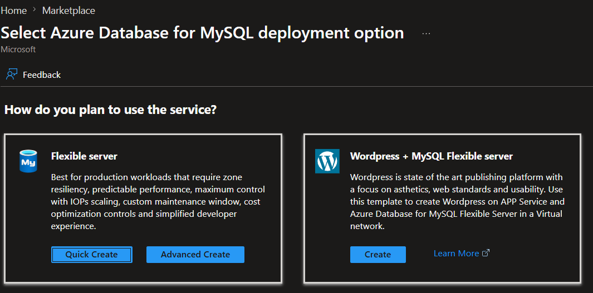
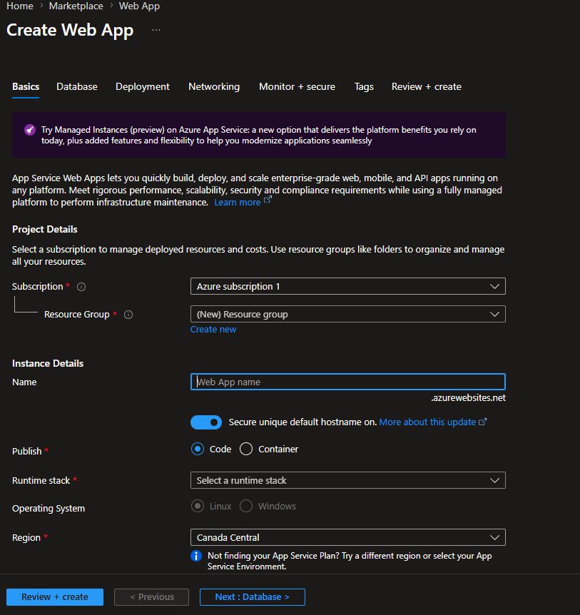
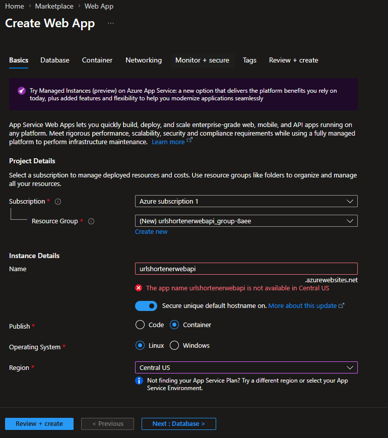
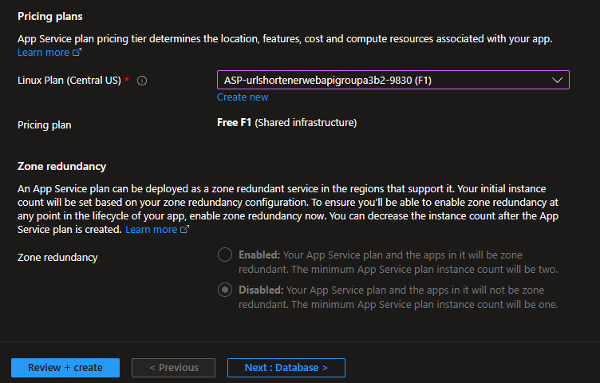
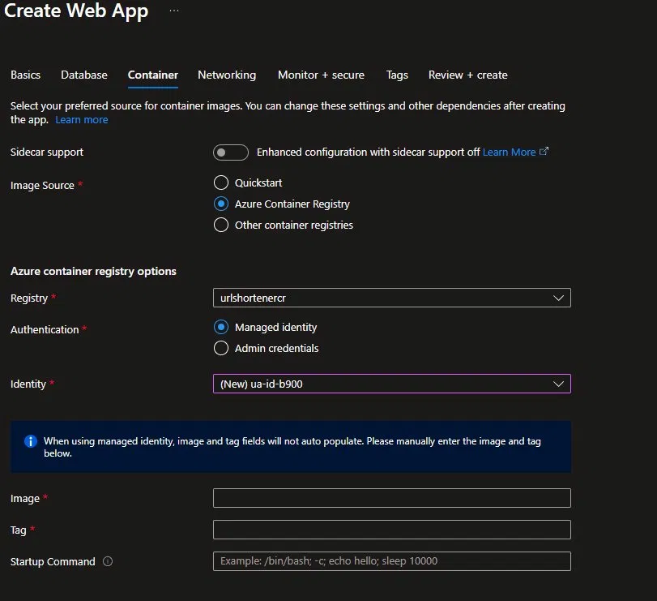

# 🔗 URL Shortener

REST API para encurtamento de URLs, desenvolvida em **.NET 10** com deploy na nuvem via **Microsoft Azure**.

---

## 🏗️ Arquitetura

O projeto segue o padrão **Clean Architecture**, que organiza o código em camadas bem definidas, onde cada camada tem uma responsabilidade clara e não depende das camadas externas.

```
URL-Shortener/
├── Domain/              # Entidades e regras de negócio puras
├── Infrastructure/      # Configurações de banco de dados (EF Core + MySQL)
├── Repository/          # Acesso aos dados (consultas e persistência)
├── Service/             # Lógica da aplicação (encurtar URL, redirecionar)
└── URL Shortener WebAPI/
    ├── Controllers/     # Endpoints da API (rotas HTTP)
    ├── DTOs/            # Objetos de transferência de dados
    ├── Dockerfile       # Configuração do container Docker
    └── Program.cs       # Ponto de entrada da aplicação
```

### Por que Clean Architecture?

- **Separação de responsabilidades**: cada camada faz só o que é dela
- **Testabilidade**: fácil de testar cada parte isoladamente
- **Manutenibilidade**: mudanças em uma camada não quebram as outras

---

## 🛠️ Tecnologias

| Tecnologia | Uso |
|---|---|
| .NET 10 | Framework principal |
| ASP.NET Core Web API | Criação dos endpoints REST |
| Entity Framework Core | ORM para acesso ao banco |
| MySQL | Banco de dados relacional |
| Docker | Containerização da aplicação |
| Swagger | Documentação e teste dos endpoints |
| Azure Web App | Hospedagem da API |
| Azure Container Registry | Repositório privado da imagem Docker |
| Azure Database for MySQL | Banco de dados em produção |

---

## 🚀 Como rodar localmente

### Pré-requisitos

- [Docker Desktop](https://www.docker.com/products/docker-desktop/)
- [.NET 10 SDK](https://dotnet.microsoft.com/download)

### Subindo com Docker Compose

```bash
# Navegue até a pasta do compose
cd docker-compose.yml

# Sobe a API e o banco de dados
docker-compose up -d
```

Acesse o Swagger em: `http://localhost:8080/swagger`

### Parando os containers

```bash
docker-compose down
```

---

## ☁️ Deploy no Azure

A aplicação está hospedada no Azure com a seguinte infraestrutura:

```
[Cliente]
    ↓ HTTPS
[Azure Web App]
    ↓ imagem Docker
[Azure Container Registry]
    ↓ connection string
[Azure Database for MySQL]
```

O Azure oferece o modelo **PaaS (Platform as a Service)**, onde a infraestrutura já vem pronta e você foca só na aplicação. Os recursos utilizados foram:

| Recurso | Função |
|---|---|
| **App Service** | Roda a API .NET em um ambiente gerenciado |
| **Azure Container Registry** | Repositório privado da imagem Docker |
| **Azure Database for MySQL** | Banco de dados gerenciado em produção |

---

### Pré-requisitos Azure

- Conta criada em [portal.azure.com](https://portal.azure.com)
- Assinatura ativa (a gratuita — **Free Tier** — é suficiente)

---

### 1️⃣ Criando o Resource Group

O Resource Group é uma pasta lógica que agrupa todos os recursos da aplicação no Azure, facilitando o gerenciamento e controle de custos.

No portal, clica em **"Resource groups"** → **"Create"** e preenche:



- **Resource group name:** `url-shortener-rg`
- **Region:** Brazil South

Clica em **"Review + Create"**:



Após criar, o Resource Group aparece vazio e pronto pra receber os recursos:



---

### 2️⃣ Criando o Container Registry (ACR)

O Azure Container Registry é o repositório privado onde a imagem Docker da API fica armazenada. Diferente do Docker Hub (público), o ACR fica dentro da sua infraestrutura Azure.

Dentro do Resource Group, clica em **"+ Create"** → pesquisa por **"Container Registry"** e configura:

- **Registry name:** `urlshortenercr`
- **Location:** Brazil South
- **Pricing plan:** Standard

Clica em **"Review + Create"** → **"Create"**.

---

### 3️⃣ Criando o Azure Database for MySQL

No Resource Group, clica em **"+ Create"** → pesquisa por **"Azure Database for MySQL"**:



Escolhe **"Flexible Server"** e clica em **"Quick Create"**:





E configura:

- **Server name:** `urlshortenerrgmysql`
- **Region:** Brazil South
- **MySQL version:** 8.0
- **Admin login:** `admdb`
- **Password:** sua senha



Em **Networking**, habilita **"Allow public access from any Azure service within Azure to this server"** para permitir que o Web App se conecte ao banco.

Clica em **"Review + Create"** → **"Create"**.

---

### 4️⃣ Criando o Web App

No Resource Group, clica em **"+ Create"** → pesquisa por **"Web App"** e configura:





- **Name:** `urlshortenerwebapi`
- **Publish:** Container
- **Operating System:** Linux
- **Region:** Central US *(Brazil South não tinha cota disponível)*
- **Pricing plan:** F1 (Free)

Na aba **Container**:



- **Image Source:** Azure Container Registry
- **Registry:** `urlshortenercr`
- **Image:** `url-shortener`
- **Tag:** `v1`

Clica em **"Review + Create"** → **"Create"**.

---

### 5️⃣ Configurando as variáveis de ambiente

Após criar o Web App, vai em **Settings → Environment variables** e adiciona:

| Variável | Valor |
|---|---|
| `WEBSITES_PORT` | `8080` |
| `ConnectionStrings__DefaultConnection` | `Server=urlshortenerrgmysql.mysql.database.azure.com;Database=url_shortener;User=admdb;Password=***` |

---

## 📡 Endpoints

Acesse a documentação completa pelo Swagger:

```
https://urlshortenerwebapi-g3g2g2bmfvf0ctdx.centralus-01.azurewebsites.net/swagger
```

---

## 🐳 Docker

A imagem da aplicação está publicada no Azure Container Registry:

```
urlshortenercr.azurecr.io/url-shortener:v1
```

E também no Docker Hub:

```
whoshingtondev/urlshortener:v1
```
